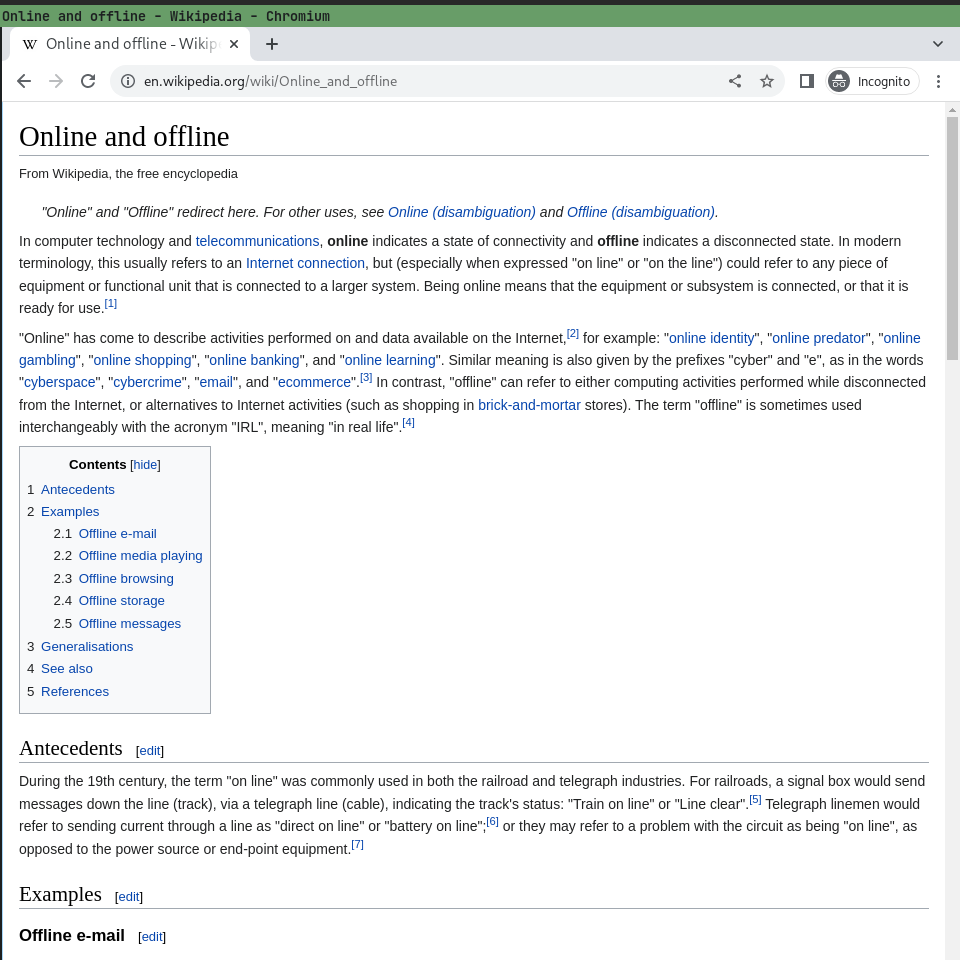
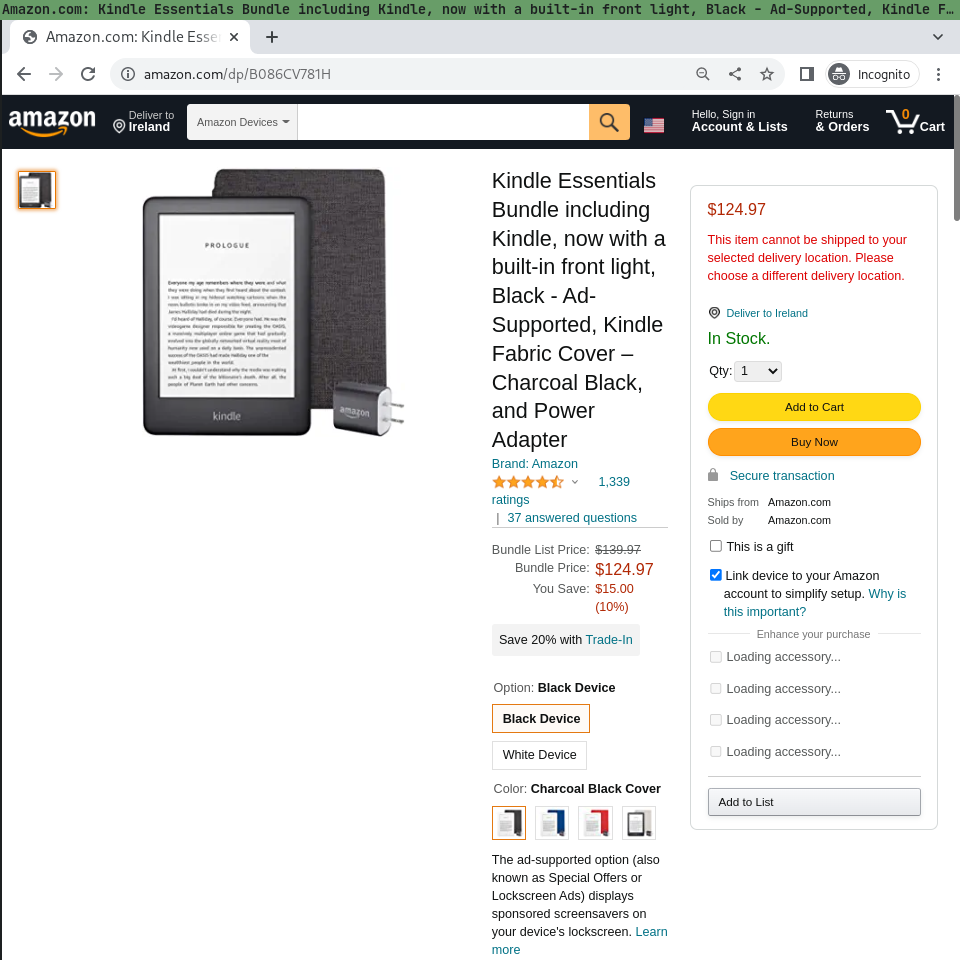

# Web-snaphots

Create "perfect" snapshots of web pages.


## Install

``` shell
$ npm install git+https://github.com/croqaz/web-snap.git
```

## Usage

``` shell
$ web-record https://en.wikipedia.org/wiki/Online_and_offline
```

This will open a Chrome-like browser, show you the page and create an output file called by default: "snapshot_en.wikipedia.org.json"
To restore this snapshot file, you can use:

``` shell
$ web-restore snapshot_en.wikipedia.org.json
```

This will open a Chrome-like browser, show the page and you can read it even if you're offline.

You can also save and restore more complicated pages, like Amazon products:

``` shell
$ web-record https://www.amazon.com/dp/B07978J597/
$ web-restore snapshot_amazon.com.json
```

Note that some pages should be scrolled a little bit and hover some elements, to make sure all the page and images are loaded before the snapshot is taken.
This is not a limitation of web-snap, it's how modern browsers and pages are intentionally built to load resources lazily, on demand.

For a complete example, with all the flags:

``` shell
$ web-record https://en.wikipedia.org/wiki/Online_and_offline --gzip \
    --rm 'script, #mw-navigation, #mw-page-base, #mw-head-base, #footer-icons' \
    --css '#content{margin-left:0 !important}' --drop '.png$, .css$' --wait 10 \
    --js off --minify --purgeCSS
```



This will store the page just like before, but it will do a lot of pre-processing, to reduce the snapshot size from *1.3MB*, to only *27K* (48x smaller), without losing any useful information.

The `--gzip` flag will archive the JSON using GZIP. It is totally safe to use.<br>
The `--rm` flag, or `--removeElems`, will remove the specified page elements, using selectors. This can be used to remove useless elements so you can focus on the important content and reduce the snapshot size.<br>
The `--css` flag, or `--addCSS`, will add custom CSS on the page, before creating the snapshot. This can be used to change the font size, or move some elements to make the page look nicer.<br>
The `--drop`, or `--dropRequests` flag, will drop all HTTP requests matching, with regex. This can be used to stop tracking requests and reduce the final snapshot size.<br>
The `--wait` how much the browser page will stay open (in seconds) to allow the user to interact with the page, eg: accept cookies, close popups, scroll a little, hover some images.<br>
The `--js` flag will stop the browser from executing Javascript and will drop all Javascript requests, which usually reduces the snapshot size by A LOT. NOTE that this option will completely break many pages.<br>
The `--minify` flag will try to compress the final HTML as much as possible, to reduce the snapshot size. NOTE that this can crash for some pages with lots of Javascript.<br>
The `--purgeCSS` flag will purge all unused CSS and replace all styles with this processed CSS. This can reduce the snapshot size by A LOT, but will completely break some pages.

And a last example, how to capture an Amazon page:

``` shell
web-record https://www.amazon.com/dp/B086CV781H --gzip \
    --rm 'script #nav-main #mars-fs-wrapper #rhf #navFooter #navBackToTop' \
    --drop '//fls-na.amazon.com/1 //unagi.amazon.com/1 //unagi-na.amazon.com/1 //cloudfront-labs.amazonaws.com/' \
    --js off --minify --wait 10
```



These options will reduce the Amazon snapshot from ~*21MB*, to *857K* (24x smaller), without losing any useful information.

If you care about the snapshot size, you need to try different options depending on the domain, to see what works.


## File format

The `snapshot.json` file format is simple:

- url - is the URL specified when creating the snapshot
- base_url - this is the resolved URL, after redirects (eg: may redirect to HTTPS and www.)
- canonical_url - (optional) this is the canonical URL of the page
- title - (optional) this is the title of the page
- html - is the final, settled HTML of the page
- responses - contains all the resources of the page (CSS, JS, images, etc) as key-value pairs:
    - body - the resource body saved as Quopri or Base64
    - headers - a limited subset of the response headers
    - request_url - the initial resource URL
    - response_url - (optional) the final response URL, after redirects (if it's different than the request URL)
    - status - a number representing the HTTP status

The format is subject to change, ideally to simplify it.


## Limitations

This format doesn't usually capture the audio and video of the page.<br>
This means you can't completely capture Youtube, Vimeo, or Spotify pages. (YET? or never?)<br>
This limitation may change in the future, but it's not the primary goal of the project.

There are also issues with some iframes and shadow DOM nodes.

Read my article that compares WARC, rrWeb and "recorded":
https://crlf.link/log/entries/220803-web-snap/


## Similar

- https://github.com/Y2Z/monolith
- https://github.com/go-shiori/obelisk
- https://github.com/danburzo/percollate
- https://github.com/croqaz/clean-mark
- https://github.com/gildas-lormeau/SingleFile
- https://github.com/sindresorhus/capture-website

Also check:

- https://crlf.link/mem/offline
- https://crlf.link/mem/web-archiving
